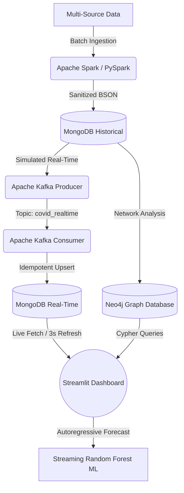

```markdown
# 🌍 PandemicPulse: Global Epidemiological & Infodemic Big Data Analytics Platform

[](https://spark.apache.org/)
[](https://kafka.apache.org/)
[](https://www.mongodb.com/)
[](https://neo4j.com/)
[](https://www.docker.com/)
[](https://streamlit.io/)

An enterprise-grade, highly scalable, and modular Big Data architecture engineered to track, model, and mitigate global health crises[cite: 2]. Moving beyond static reporting, **PandemicPulse** bridges historical batch processing with real-time event streaming and graph-based relationship analytics to combat both viral outbreaks and the socio-informational challenges of the modern "infodemic"[cite: 2].

The entire ecosystem is fully containerized, establishing a reusable blueprint ready to adapt to tomorrow's epidemiological emergencies[cite: 2].

---

## 🏗️ End-to-End System Architecture

The platform implements a highly decoupled Lambda/Kappa-inspired pipeline distributed across four distinct core layers:



### 📶 Data Pipeline Breakthrough

1. **Heterogeneous Data Ingestion:** Integrates and unifies clinical and sociological streams across 180+ countries:


* **Epidemiological & Policy Data:** Merged Kaggle records and Our World in Data (OWID) containment datasets.


* **Infodemic Tracking:** Google Trends API tracking disinformation markers to compute custom indicators (*Disinfo Index*, *ProScience Index*, *Trust Ratio*).


* **Fact-Checking Validation:** Triangulated with the **FakeCovid** dataset (7,600+ fact-checked articles across 40 languages).


2. **Distributed ETL (Apache Spark):** Leverages PySpark for partitioned data preparation, executing strict structural quality checks and high-throughput schema casting before pushing records to **MongoDB** in optimized chunks.


3. **Event-Driven Streaming (Apache Kafka):** Orchestrated in an isolated network via Docker Compose. A resilient Producer-Consumer loop streams daily bulletin sequences with automated, idempotent upserts into the active database, preventing data duplication and crash loops.


4. **Relational Graph Modeling (Neo4j):** Maps the global pandemic landscape as a complex network of 184 nodes. Utilizes high-performance Cypher queries to model epidemic pattern correlations (Pearson $\ge$ 0.85), government restriction similarities, and geographical boundary diffusion rates.


---

## 📊 Streaming Machine Learning & Predictive UI

The user-facing ecosystem is driven by an interactive, live-updating **Streamlit Dashboard** containing over 16 advanced analytics interfaces:

* **Adaptive Forecasting:** Integrates an autoregressive **Random Forest Regression** model (200 trees) with Exponential Smoothing. The model automatically re-trains on the live incoming Kafka streams at every page refresh to dynamically generate 60-day prediction windows.


* **Feature Importance Insights:** Evaluates and renders real-time feature hierarchies using the Gini Index to pinpoint which containment policies or informational factors impact the infection rate the most for each specific country.


* **Advanced EDA Explorers:** Interactive log-scale time-lapses, synchronized moving averages, and live 3-second UI auto-refresh cycles that emulate production-grade control rooms.


---

## 🛠️ Technology Stack & Prerequisites

Before running the project, ensure you have the following installed:

* [Docker](https://www.docker.com/) & Docker Compose
* Python 3.x

---

## 🚀 Quick Start Guide

1. Download the project folder to your Desktop, then open your terminal and run:

```bash
   cd Desktop

```

2. Navigate into the project directory:

```bash
   cd PROGETTO

```

3. Grant execution permissions to the setup script (only required before the first launch):

```bash
   chmod +x start.sh

```

4. Run the initialization script:

```bash
   ./start.sh

```

The script will automatically execute the following sequence:

1. Spin up the Docker containers (MongoDB, Kafka, Zookeeper, Neo4j).


2. Install all required Python dependencies.
3. Import the CSV datasets into MongoDB via Apache Spark.


4. Trigger the Neo4j graph analysis in the background.


5. Launch the Apache Kafka Consumer in a new terminal window.


6. Launch the Apache Kafka Producer in a new terminal window.


7. Start and open the Streamlit dashboard UI in the foreground.


### 🛠️ Manual Launch Alternative

If you prefer to start each service manually, execute the following commands in order:

1. **Spin up Docker services:**

```bash
   docker compose up -d

```

2. **Install Python dependencies:**

```bash
   pip install -r requirements.txt
   pip install pyvis

```

3. **Import data into MongoDB via Spark:**

```bash
   python3 2_spark_to_mongo.py

```

4. **Execute Neo4j graph analysis (in background):**

```bash
   python3 8_neo4j_graph_analysis.py &

```

5. **Start Kafka Consumer (in a separate terminal):**

```bash
   python3 7_kafka_consumer_adapted.py

```

6. **Start Kafka Producer (in a separate terminal):**

```bash
   python3 6_kafka_producer_adapted.py

```

7. **Launch the interactive dashboard:**

```bash
   streamlit run 5_dashboard.py

```

---

## 🛑 Stopping the Services

To shut down all running Docker containers:

```bash
docker compose down

```

To shut down containers and completely wipe persistent data volumes:

```bash
docker compose down -v

```

---

## 📁 Repository Blueprint

```text
PROGETTO/
├── docker-compose.yml          # Docker services configuration stack[cite: 2]
├── requirements.txt            # Project Python dependencies
├── start.sh                    # Automated end-to-end launch script
├── data/                       # CSV datasets directory[cite: 2]
├── 2_spark_to_mongo.py         # ETL Pipeline: CSV → Spark → MongoDB[cite: 2]
├── 5_dashboard.py              # Streamlit interactive UI application[cite: 2]
├── 6_kafka_producer_adapted.py # Apache Kafka event stream Producer[cite: 2]
├── 7_kafka_consumer_adapted.py # Apache Kafka event stream Consumer[cite: 2]
└── 8_neo4j_graph_analysis.py   # Neo4j graph analytics and modeling routines[cite: 2]

```

---

## 👥 Authors

* **REGA Giuseppe**

* **BRUNO Asia**

* **GILIBERTI Felicita**


```

```
